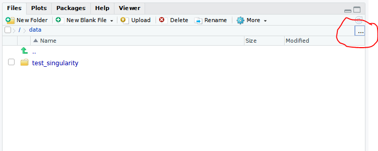

The easiest way to get started uning `cyCONDOR` is by deploying the `Docker` container
we provide with each release of the package. This container is based on the `Bioconductor` image and start an `RStudio` server session on your `localhost` accessible from any browser.

In this vignette we will cover a few option to deploy our `Docker` container in your computing infrastructure. If your specific situation is not covered do not hesitate to contact us.

First we will show how to install `Docker Desktop` on any Windows or Mac machine, we will then cover some basic set-up for the configuration of `Docker` in a remote server.

Last we will show how to deploy our `Docker` container using `Singularity` as for safety reasons many research
institutions are not allowing `Docker` containers in their IT infrastructure anymore.

# Run cyCONDOR with `Docker Desktop` (PC/Mac)
Install `Docker` or another tool to deploy Docker containers (e.g., `Singularity`).

*Note*: depending on the operating system follow the instructions at https://www.docker.com/, on Windows also the Windows Subsystem for Linux needs to be installed:

1. Set up the Windows Subsystem for Linux 2 (`WSL2`) and any of the available Linux distributions:
    - Install `WSL2` first following the instructions reported here: https://learn.microsoft.com/en-us/windows/wsl/install
    - Install `Ubuntu` or another Linux distribution as reported here: https://ubuntu.com/tutorials/install-ubuntu-on-wsl2-on-windows-10#1-overview

2. Download and install the latest version of `Docker Desktop`.

3. After starting the software, verify the installation of Docker Desktop.
   - Open the `Ubuntu` terminal.
   - Run:

```
docker info
```

*Note*: If `Docker` is installed and running correctly this will output some basic information on the system, if no output is produced the installation was not successful. 

Since the cause of this malfunction could be extremely diverse, it is advisable to consult the troubleshooting section of `Docker desktop` website (https://docs.docker.com/desktop/troubleshoot/overview/).

You can now start a `Docker` container for `cyCONDOR` analysis.

First download the latest version of the `Docker` image

```
docker pull lorenzobonaguro/cycondor:v022
```

Now start the container with the following command (everything in `[]` need to be edited by the user).

```
docker run -dp [YOUR PORT]:8787 ∖         # define the port to use
-e USER=[USER] -e PASSWORD=[PW] ∖         # username and password, can be defined by the user
--name cycondor_analysis ∖                # name of the container
-v [LOCAL DIRECTORY PATH]:/data/ ∖        # directory to mount
lorenzobonaguro/cycondor:022              #name of the docker image
```

You can now access your `RStudio` session with any browser at the address:

```
http://localhost:[YOUR PORT]
```

Enter now the selected `[USER]` and `[PW]` and you will have access to `Rstudio`.

To locate your data click on the `...` symbol above the `Files` tab (see picture below) and type `/data` to finally press enter.

<br>


*Exemplary `Files` windows of the `Rstudio` server*

# Run cyCONDOR with Docker on a remote server

Please follow the guideline of your institution/organization on how to access remote servers and how to manage `Docker` containers. 

Here we give a general introduction on how to `ssh` to a remote server.

First log into the remote server by typing in the terminal:

```
ssh [ServerAddress] -l [username]
```

Both `Mac OS Terminal` and `Windows PowerShell` can use natively the `ssh` protocol.  

You can now start `cyCONDOR Docker` container as previously

```
docker run -dp [YOUR PORT]:8787 ∖         # define the port to use
-e USER=[USER] -e PASSWORD=[PW] ∖         # username and password
--name cycondor_analysis ∖                # name of the container
-v [LOCAL DIRECTORY PATH]:/data/ ∖        # directory to mount
lorenzobonaguro/cycondor:022              #name of the docker image
```

The `RServer` session will now be available at the following address:

```
http://[ServerAddress]:[YOURPORT]/
```

*Note:* This vignette is not intended as an exhaustive tutorial on how to use `Docker`, we encourage the reader to explore `Docker` functionalists on https://www.docker.com.

# Stop, restart and delete a Docker container

Once you are done with your work, either on your local machine or on a remote server you can stop your `Docker` container. 

Stopped container can be started quickly without loss of temporary data or permanently removed.

To stop your `Docker` container you first need to identify the `CONTAINER ID` of your session, this can be done by typing in the terminal

```
docker container ls
```

This command will generate a list of the running containers, you need to copy the `CONTAINER ID` of the one matching with your `--name` (e.g. cycondor_analysis)

The container can now be stopped

```
docker container stop [CONTAINER ID]
```

To now restart the container simply run

```
docker contaienr start [CONTAINER ID]
```

Or alternatively to permanently remove the container

```
docker container rm [CONTAINER ID]
```

*Note:* Keep in mind that this operation will only remove the container, the `Docker` image will still be available to your system. If you want to remove also the docker image 
type `docker image rm [IMAGE NAME]`.

# Run cyCONDOR with Singularity on a remote server
Running cyCONDOR `Docker` container with `Singularity` as runtime is possible, first you need to download cyCONDOR `Docker` image and convert it to a `.sif` file:

```
singularity pull docker://lorenzobonaguro/cycondor:v022
```

This command will save the `Docker` image in the current working directory.

You can now generate a script to start the singularity container in the same directory named for example `start_singularity.sh`.

Also here everything in `[]` need to be edited by the user.

```
#!/bin/bash

#create temporary file variable
export WORKSPACE=[folder path to store tmp files]

#create temporary folders
[ -d $WORKSPACE ] || mkdir -p $WORKSPACE
cd $WORKSPACE
mkdir run tmp-rstudio-server var-lib-rstudio-server

#create a database config file
printf 'provider=sqlite\ndirectory=/var/lib/rstudio-server\n' > database.conf

#create a secure cookie key file
cd tmp-rstudio-server
uuidgen > secure-cookie-key

#prepare to load the container

PASSWORD='[UserSelectedPassword]' singularity exec \
--bind $WORKSPACE/run:/run,\
$WORKSPACE/var-lib-rstudio-server:/var/lib/rstudio-server,\
$WORKSPACE/tmp-rstudio-server:/tmp/rstudio-server,\
$WORKSPACE/database.conf:/etc/rstudio/database.conf,\
[LOCAL DIRECTORY PATH]:/data/ \
[PathToCyCONDORSifFile] rserver \
--www-address=$(hostname -i) --www-port=[YourPort] \
--auth-none=0 --auth-pam-helper-path=pam-helper --server-data-dir=/var/run/rstudio-server --server-user=[YourUsername] &
```

To start the container you need now to execute the `sh` script

```
sh ./start_singularity.sh
```

Similarly to `Docker` containers the RStudio session will be available at the address:

```
http://[ServerAddress]:[YOURPORT]/
```

# Stop a Singularity container

To stop a `Singularity` container you first need to identify the `[PID]` associated to the `Rserver` session. You can easily do it by typing in the terminal

```
top -u [YourUsername]
```

You can now stop the container by typing

```
kill [PID]
```

# Run cyCONDOR on a HPC cluster as SLURM Job
For really big dataset it is possible to run `Singularity` containers as `SLURM` jobs on HPC computer clusters. 

To set up your environment follow this detailed guide from the `Rocker` project: https://rocker-project.org/use/singularity.html.

*Note*: Mare sure your institution allows interactive session via `SLURM`, keep in mind this approach is reserving an entire node do your work and might interfere with other users.
