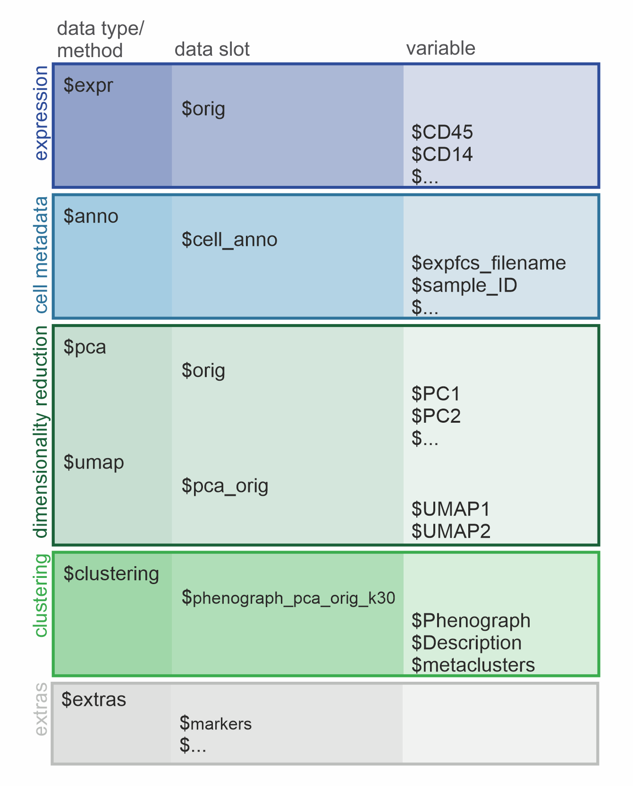

```{r setup, warning=FALSE, message=FALSE}
library(cyCONDOR)
```

In this vignette we introduce the structure of the condor object and
showcase some useful `cyCONDOR` functions to interact with it.

# Load an example dataset

```{r}
condor <- readRDS("../.test_files/condor_example_016_misc.rds")
```

# Structure of the `condor` object

Knowing the structure of one's data object is a huge advantage to
maximize the ease of using bioinformatic tools for analysis. Due to it's
straight-line composition, the structure of the `condor` object is easy
to grasp. It follows an hierarchical structure with 3 levels (data
type/method -\> data slot -\> variable) and can be separated into 5
major sections each representing one step of data acquiring or analysis
(expression, cell metadata, dimensionality reduction, clustering and
extras).

<br>



*Graphic of the condor object structure. The hierarchical levels are
depicted as columns and the the major sections are colored in.*

## Hierarchical structure

The 1st level describes the data types and methods present in the object
followed by the 2nd level specifying separate data slots for the actual
data stored as data frames (df). The 3rd level contains the variables
(column names) of the respective df.

## Overview of the 5 sections of a `condor` object

The data types `$expr` and `$anno` are created while data loading and
transformation of the `condor` object is performed and serve as the
basis for further data analysis.

### Expression

The original, transformed expression values are saved in `$expr` under
the data slot `$orig`, containing the cell markers as column names
(variables) and unique cell IDs as row names. If Batch normalization is
performed on the expression values the output is saved in a df under a
new data slot (`$norm`).

### Metadata

The metadata is saved under data type `anno` and data slot `cell_anno`.
The variables of this df correspond to the provided cell annotation and
can be used as the argument `group_var` in many visualization functions.

### Dimensionality reductions

Each output of a dimensionalty reduction or clustering function will be
saved as a df under their specified method (e.g. `$pca`, `$umap`,
`$clustering`) and data slot (e.g. `$orig`, `$pca_orig`,
`$phenograph_pca_orig_k30`). The variables of the dimensionality
reductions (e.g. `$PC1`, `$PC2`) will be used by `cyCondor`
automatically as coordinates for visualization embedding when the method
and data slot are specified (arg: `reduction_method` and
`reduction_slot`).

### Clustering

After clustering a data slot will be created under the `$clustering`
method, named with a combination of the relevant parameters used for the
calculations (eg. `phenograph_pca_orig_k30`). The available variables
(e.g. `$Phenograph` ) are used as a basis for cell labeling, later saved
under the variable (`metaclusters`).

### Extras

`$extra` contains all additional data to be stored (e.g. parameters of
data loading, lists of markers, dimensionality reduction or clustering
models for future data projection).

# Extract or change marker names

## Get measured markers

The function `measured_markers` takes the condor object as `fcd` input
and returns the number of markers that are included in the condor object
and a list of their names. By directing the output to a variable it is
possible to save the list of the marker names for future use.

```{r}
expr_markers <- measured_markers(fcd = condor)
```

## Change parameter names

The function `change_param_name` allows for the quick and easy changing
of single or multiple parameter names. It needs the condor object as
`fcd` input and vectors for the old and new parameter names (`old_names`
and `new_names`, respectively). In the first example we change only the
name of the *PD-1* marker to *PD1*.

```{r}
condor <- change_param_name(fcd = condor, 
                            old_names = "PD-1", 
                            new_names = "PD1")
```

It is also possible to modify multiple names at the same time. The
vector *NewNames* can either be written manually or computed using
vector manipulations. In the second example below we exclude the protein
names from the specific markers. It is important, that the order of the
old and new marker names stay the same.

```{r}
OldNames <- c("CD195 (CCR5)", "CD94 (KLRD1)", "CD127 (IL7RA)", "CD197 (CCR7)", "CD123 (IL3RA)")
NewNames <- unlist(strsplit(OldNames, " "))[2*(1:length(OldNames))-1] 

condor <- change_param_name(fcd = condor, 
                            old_names = OldNames, 
                            new_names = NewNames)
```

## Get used markers

To keep track on which markers have been used as basis for
dimensionality reduction or clustering the respective markers are being
saved in the extra slot of the `condor` object. The `used_markers`
function can be used to extract those markers.

It takes as input

-   the `fcd` object (e.g. condor),
-   the `input_type` (pca, umap, tSNE, diffmap, phenograph or FlowSOM),
-   the `data_slot` (orig or norm),
-   the `prefix` (if specified before, see dimensionality reduction or
    clustering)

and returns, similar to the `measured_markers` function, the number and
names of the markers used for the specific analysis step.

```{r}
pca_orig_markers <- used_markers(fcd = condor, 
                                 input_type = "pca", 
                                 data_slot = "orig",
                                 prefix = NULL)
```

Below we show an example of markers used for the PCA calculation with an
exclusion of the scatter markers `FSC-A` and `SSC-A`. The `prefix` used
in this PCA calculation was defines as *scatter_exclusion*.

```{r}
pca_scatter_exclusion_orig_markers <- used_markers(fcd = condor, 
                                 input_type = "pca", 
                                 data_slot = "orig",
                                 prefix = "scatter_exclusion")
```

# Check the integrity of the `condor` object

The `check_IDs` function can be useful to make sure the condor object
has the right structure for all downstream analysis. It checks the cell
IDs at each level and compares them to the `fcd$expr$orig` data frame.
If a discrepancy appears at any point, a warning will be returned.

```{r}
check_IDs(condor)
```

# Merge or subset the `condor` object

## Merge two `condor` objects

The `merge_condor` function combines two `condor` objects comprised of
the same parameters (markers). This function will merge only expression
table and annotation as all the downstream analysis will need to be
repeated. If the cell IDs are doubled between the two objects the
merging can not be facilitated.

```{r, eval=FALSE}
condor_merged <- merge_condor(data1 = condor, 
                              data2 = condor)
```

## Subset a `condor` object

The `subset_fcd` function subsets the `condor` object to a specific
number of randomly selected cells specified with the `size` parameter. A
seed can be set for reproducibility.

```{r}
condor_subset <- subset_fcd(fcd = condor, 
                            size = 5000,
                            seed = 91)
```

## Subset a `condor` object equally for a variable

The `subset_fcd_byparam` function subsets the `condor` object to a
specific number of randomly selected cells specified with the `size`
parameter in each of the specified `param`. A seed can be set for
reproducibility.

```{r}
condor_subset_sample <- subset_fcd_byparam(fcd = condor, 
                                           param = "sample_ID", 
                                           size = 500, 
                                           seed = 91)
```

## Filter a `condor` object to create a specific subset

The `filter_fcd` function can be useful to created a specific subset of
a `condor` object. It takes the row names of the cells to be filtered as
`cell_ids` input.

```{r}
condor_filter <- filter_fcd(fcd = condor, 
                            cell_ids = rownames(condor$expr$orig)[condor$clustering$phenograph_pca_orig_k_60$metaclusters == "Classical Monocytes"])
```

## Subsample the condor object with Geometric Sketching

The `subsample_geosketch` function can be useful if you want to speed up calculations of large datasets, without loosing information. It subsamples in a way, which preserves the topology of the PCA of a `condor` object, therefore reducing the number of data points, without skewing cell densities. You can provide the number of cells you want to subset or the fraction of cells you want to subset for. 

```{r}
condor_sub <- subsample_geosketch(condor,pca_slot = "orig",n_sub=10000)
```

## Compare cyCONDOR frequencies with FlowJo results

We provide an easy to use function to calculate the correlation between cyCONDOR results and the cell frequency obtained with other analysis tools such as FlowJo.

```{r, eval=TRUE, include=F}
df_flowjo <- data.frame(
  sample_ID = paste0("Sample_", 1:10),
  FlowJo_B_class_switched = c(0.07143, 0.03125, 0.01333, 0.0625, 0.21429, 0.1, 0.18182, 0.11111, 0.1, 0.15126),
  FlowJo_CD4_CM            = c(0.14286, 0.09375, 0.06667, 0.1875, 0.21429, 0.1, 0.09091, 0.22222, 0.1, 0.13445),
  FlowJo_CD8_CM            = c(0.03571, 0.03125, 0.06667, 0.0625, 0.07143, 0.1, 0.09091, 0.33333, 0.1, 0.11765),
  FlowJo_CD69_pos        = c(0.10714, 0.125, 0.06667, 0.125, 0.07143, 0.1, 0.09091, 0.11111, 0.1, 0.10084),
  FlowJo_Naive_CD4         = c(0.21429, 0.0625, 0.06667, 0.25, 0.07143, 0.1, 0.09091, 0.11111, 0.1, 0.08403),
  FlowJo_Naive_CD8         = c(0.01429, 0.0625, 0.06667, 0.25, 0.03571, 0.1, 0.04545, 0.11111, 0.1, 0.06723),
  FlowJo_Treg              = c(0.02143, 0.0625, 0.13333, 0.0625, 0.03571, 0.1, 0.04545, 0.05556, 0.1, 0.05042),
  FlowJo_DCs               = c(0.02857, 0.03125, 0.06667, 0.125, 0.03571, 0.1, 0.04545, 0.05556, 0.1, 0.03361),
  FlowJo_NK_CD56dim        = c(0.04286, 0.0625, 0.06667, 0.0625, 0.01786, 0.1, 0.01818, 0.02778, 0.1, 0.01681),
  FlowJo_Unconventional_T  = c(0.03571, 0.4375, 0.45333, 0.0625, 0.30357, 0.1, 0.09091, 0.05556, 0.1, 0.3437)
)


df_condor <- data.frame(
  sample_ID = paste0("Sample_", 1:10),
  
  Condor_B_class_switched = c(0.07143, 0.03125, 0.01333, 0.0625, 0.21429, 0.1, 0.18182, 0.11111, 0.1, 0.15126) + 0.1,
  Condor_CD4_CM            = c(0.14286, 0.09375, 0.06667, 0.1875, 0.21429, 0.1, 0.09091, 0.22222, 0.1, 0.13445) + 0.2,
  Condor_CD8_CM            = c(0.03571, 0.03125, 0.06667, 0.0625, 0.07143, 0.1, 0.09091, 0.33333, 0.1, 0.11765) + 0.3,
  Condor_CD69_pos         = c(0.10714, 0.125, 0.06667, 0.125, 0.07143, 0.1, 0.09091, 0.11111, 0.1, 0.10084) + 0.4,
  Condor_Naive_CD4         = c(0.21429, 0.0625, 0.06667, 0.25, 0.07143, 0.1, 0.09091, 0.11111, 0.1, 0.08403) + 0.3,
  Condor_Naive_CD8         = c(0.01429, 0.0625, 0.06667, 0.25, 0.03571, 0.1, 0.04545, 0.11111, 0.1, 0.06723) + 0.2,
  Condor_Treg              = c(0.02143, 0.0625, 0.13333, 0.0625, 0.03571, 0.1, 0.04545, 0.05556, 0.1, 0.05042) + 0.2,
  Condor_DCs               = c(0.02857, 0.03125, 0.06667, 0.125, 0.03571, 0.1, 0.04545, 0.05556, 0.1, 0.03361) + 0.5,
  Condor_NK_CD56dim        = c(0.04286, 0.0625, 0.06667, 0.0625, 0.01786, 0.1, 0.01818, 0.02778, 0.1, 0.01681) + 0.9,
  Condor_Unconventional_T  = c(0.03571, 0.4375, 0.45333, 0.0625, 0.30357, 0.1, 0.09091, 0.05556, 0.1, 0.3437) + 0.4
)
```

The two dataframe should look like this, it is impartant that every colum name is starting with `Condor_` for the condor dataframe and `FlowJo` for the FlowJo dataframe. 
```{r}
df_condor
```

```{r, fig.width=7, fig.height=7}
corr_plot_comparison(condor_df = df_condor, 
                     flowjo_df = df_flowjo, 
                     sample_col = "sample_ID",
                     method_corr = "pearson", 
                     tl.cex = 1, 
                     cl.cex = 1)
```


# Session Info

```{r}
info <- sessionInfo()

info
```
