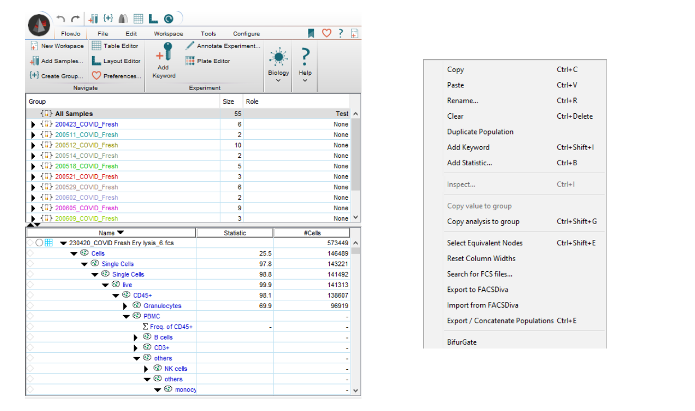
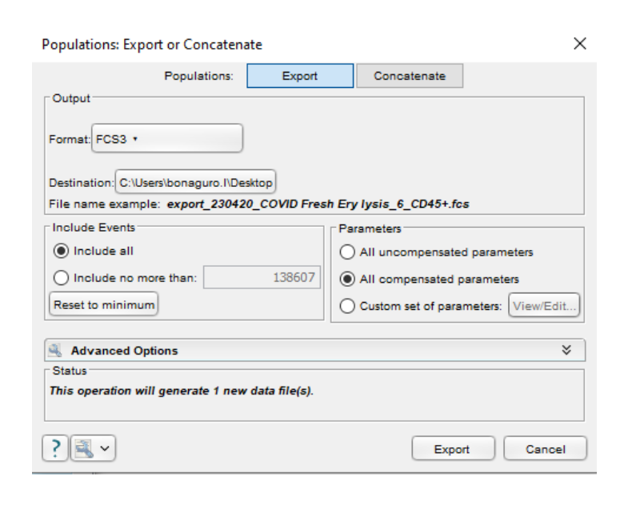
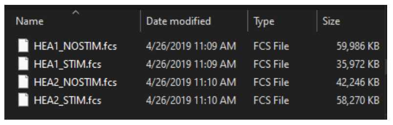
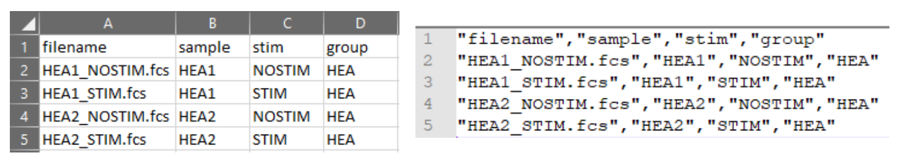

We provide here a detailed step-by-step guideline on how to export compensated `.fcs` files from `FlowJo v10` and prepare the metadata annotation table for `cyCONDOR` analysis.

## Step 1 
Within the `FlowJo workspace`, you can adjust compensation as needed and optionally apply a `basic gating hierarchy` to your data. This is recommended to remove debris and unwanted cells, reducing the size of your final dataset and improving computational efficiency. For instance, during immune cell analysis, consider gating on `CD45+` cells for `cyCONDOR` analysis.

## Step 2 

Right-click in the gate you want to export and select `Export/Concatenate Populations`

*Tip:* If you want to export this gate for all the samples in the workspace, before this step right-click on the desired gate and select `Select Equivalent Nodes` to select the same gate in all samples.

 
 

*Exemplary `FlowJo workspace` (left) and exemplary option window shown after right-clicking on the desired gate*

## Step 3

Now, choose the format for your exported data. `FCS3` is the recommended format. Additionally, select the destination folder where you want to save the file. You have two options for selecting which channels to export:

 - **Export all compensated values:** This option is selected in the image below and will export all channels that have been compensated.
 - **Manually select compensated channels:** This option allows you to choose specific compensated channels to include in the exported `.fcs` file.
 
*Note:* If data were not compensated in FlowJo, for example cyTOF data or BD S8 unmixed data, export `uncompensated` values.

 

*`Population Export or Concatenate` window*

## Step 4
Click on `Export`. Now all selected files will be exported in the selected folder. As input for `cyCONDOR` the `data_path` should only contain the `.fcs` files intended for the analysis.

 

*Exemplary folder with exported `.fcs` files*

## Step 5
The `annotation table`, used to load `.fcs` files, should have the file names of all `.fcs` files in the first column. Additional columns can be included to store any relevant metadata for your analysis. There are no restrictions on the type of information you can include in these metadata columns. We advise to save the annotation table in a separate folder and save it as comma separated `.csv` file. An example of annotation table is shown below:

 

*Exemplary metadata table visualized in Excel (left) and Notepad (right)* 
